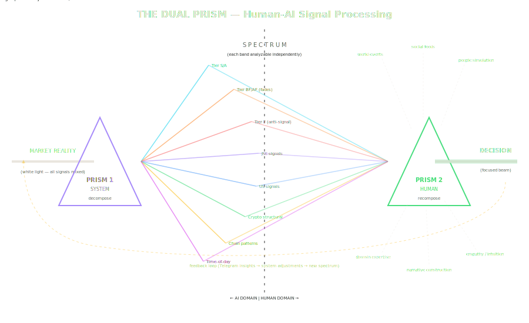

# Co-Evolutionary Meta-Learning in Hybrid AI Trading Systems

A 28-page research paper and supporting materials from a 25-day live experiment in human-AI collaboration, conducted through 590,000+ tokens of continuous dialogue with Claude Code (Anthropic).

**The core finding:** A prediction system's structured failure modes are more valuable than its successes. By characterizing *how* the AI fails — not trying to make it succeed — we built a "fade machine" that exploits anti-signals (31–65% accuracy when trading against the system's confident-but-wrong predictions). The system is not a predictor. It's an instrument that measures market noise.

---

## What's Here

| Directory | Contents |
|-----------|----------|
| `paper/` | Full research paper (28 pages, LaTeX-compiled PDF, pgfplots graphs, 40+ citations) |
| `visualizations/` | Signal processing diagrams: antenna gain pattern, spectral response, dual prism model, filter chain, waterfall spectrogram |
| `system/` | Key source files: market-specific tier classifier, autonomous Opus orchestrator brain (335 lines), gold nugget knowledge base |
| `evidence/` | Independent session confirmation — a second 500K+ token collaboration with a different Claude instance replicated the same co-evolutionary pattern |

## The Thesis

Most AI research asks "how do we predict better?" This project asks "how do we characterize failure better?" — and discovers that the answer is the same.

The **Co-Evolutionary Meta-Learning Stack** describes a four-layer process:
- **Layer 0 (Market):** Generates price action (signal + noise)
- **Layer 1 (System):** Filters market noise into predictions + structured errors
- **Layer 2 (Human):** Observes system errors, identifies patterns 3–5 days before statistical significance
- **Layer 3 (AI):** Formalizes human intuitions into implementable code

The stack is bidirectional — each layer reshapes the others. The human spots patterns the AI can't see. The AI formalizes patterns the human can't articulate. Together they produce insights neither would reach alone.

## The Dual Prism Model

The AI decomposes complex reality into analyzable spectral bands (Prism 1). The human recomposes the spectrum into a focused decision by adding world context, narrative, and empathy (Prism 2). Neither prism works alone.

## Key Results

| Metric | Value |
|--------|-------|
| Total trades | 1,000+ (live, not backtested) |
| Anti-signal accuracy (faded) | 57–65% |
| Direct prediction accuracy | 35–48% |
| Paper trading Sharpe ratio | 1.45 (832 trades) |
| Autonomous Opus discoveries | 3 statistically significant findings on first dream session |
| Independent replications | 3 (trading, workflow builder, ISP support) |

## The Autonomous Opus Orchestrator

The system runs itself. An Opus-based AI agent:
- Wakes up daily, audits the trading system, adapts parameters
- Has persistent "dream memory" for research continuity
- Spawns Haiku/Sonnet sub-agents for overnight research
- Discovered a statistically significant anti-signal (22:00 UTC, p < 0.001) autonomously
- Communicates with the human operator via Telegram
- Self-schedules follow-up investigations

See `system/opus_orchestrator.md` for the full agent architecture (335 lines).

## Author

**Jaco Boltman** — Wireless network engineer, Pretoria, South Africa. Self-taught. 38 Obsidian-based production systems built through human-AI collaboration. Former competitive Rocket League player ([RLCS Sub-Saharan Africa](https://liquipedia.net/rocketleague/Motty)).

## License

MIT
